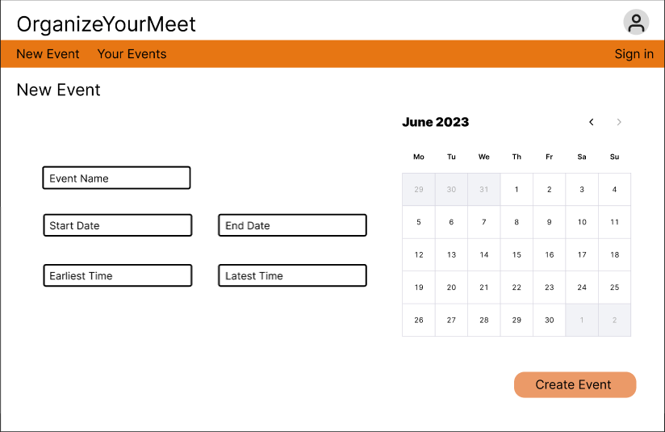

# OrganizeYourMeet
when2meet.com is a website to schedule meetings by creating an event page where everyone can fill in their availabilities. 

### Features in this iteration:
-	Sign-up page + Log-in page for account availability management
-	Event creation page where you can set the name of the page, the start and end dates of the possible meeting dates as well as the meeting start and end times for each day
o	Custom link generated for each unique event
-	Event page where users can input their availability and see the group availability
    -  Do a local overlay with the group so that the input and the group availability can be seen on the same screen

### Others:
-	Calendar feature to import availabilities from calendar 
-	Recommended meeting timing for each event

## Wireframe:

(overall wireframe on figma)

(home page)

(create event page)

(event page)

(your events page)

(sign in page)